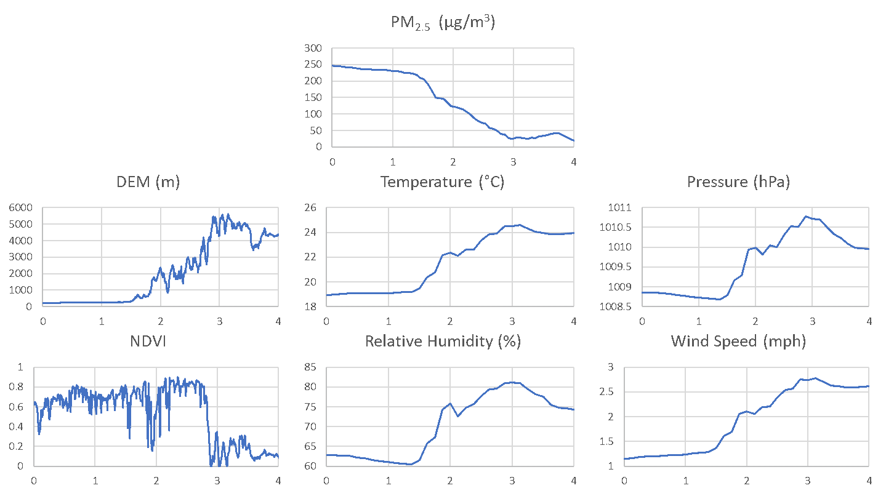

# 1 Introduction

With an average elevation of over 4000m above sea level, the Tibetan Plateau, often called the ‘Third Pole of the World’, is the largest and highest plateau in the world. Given its exceptionally high altitude, relatively low levels of population and industry, and its strategic location between rapidly industrialising regions in China and India [@loewen_atmospheric_2007], the Tibetan Plateau provides a unique opportunity to study the influence of elevation on the transmission of fine particulate matter.

Atmospheric fine particles, or PM2.5 (particles of less than 2.5 micrometres in diameter), pose a serious risk to human health and the environment. PM2.5 can penetrate deeply in lungs and impair lung function, causing harm to the human respiratory system [@xing_impact_2016]. Apart from its detrimental effects on human health, increased PM2.5 concentrations also result in negative environmental effects in the Tibetan Plateau. Studies have shown that atmospheric pollutants contribute to changes in climate due to their effects on solar radiation and the albedo of snow surfaces, potentially having wide-ranging effects on regional climates [@kang_linking_2019]. Having a sensing of the spatio-temporal distribution of PM2.5 emissions is crucial in designing strategies to maintain PM2.5 concentrations at healthy levels, to reduce harm to human health and the environment.

PM2.5 emissions in China have been studied extensively in existing literature. @jin_spatio-temporal_2017 explored the spatio-temporal variation in PM2.5 in China over 2005 to 2014, and found that PM2.5 emissions was associated with economic development and population growth. Although this is not directly relevant to the Tibetan Plateau, which lacks large-scale industrial activity and dense populations, Jin found that Tibet and Qinghai have consistently been the provinces with the two lowest PM2.5 concentrations over the few years. @li_air_2019 provided a more detailed analysis of air pollution characteristics in China during 2015 to 2016, including seasonal variations of PM2.5 emissions. This helps in differentiating changes in PM2.5 concentrations caused by seasonal variations in atmospheric conditions, as opposed to changes in PM2.5 concentrations relating to elevation. 

The sources of PM2.5 in the Tibetan Plateau and the neighbouring regions have also been explored. Although biomass burning, a possible contributor to PM2.5 concentrations, is common in the Tibetan Plateau [@li_mixing_2015], majority of the PM2.5 observed in our study is likely to be created in neighbouring regions with greater anthropogenic activity and transported to the plateau. @yang_vital_2019 found that residential sources of PM2.5 were low in the Tibetan Plateau compared to the Sichuan and Guanzhong basins during wintertime pollution events, while @jia_source_2015 observed that in the summer, dust particles in the Tibetan Plateau primarily originate from the neighbouring Taklamakan and Great Indian Thar Deserts, and the Gurbantunggut Desert.

Existing studies have established an inverse relationship between altitude and PM2.5 concentrations. @bisht_tethered_2016 found that PM2.5 concentrations decreased at higher altitudes due to greater windspeeds and the inverted temperature distribution, which suppressed upward dispersion of ground level emissions. In light of this established relationship, this study will explore the spatio-temporal variation of PM2.5 concentrations around the Tibetan Plateau and evaluate the influence of elevation in creating a barrier to PM2.5 transmission into the Tibetan Plateau.

# 2 Methodology

## 2.1 Study Region
This study focused on a spatial extent that encompasses the entire Tibetan Plateau and surrounding areas including the Tarim Basin, parts of Sichuan province in China, Nepal and India. This extent provided ample opportunities to explore the extreme variation in altitudes in the areas surrounding the Tibetan Plateau and the corresponding PM2.5 concentrations. The exact coordinates limiting the demarcating the study area are (28°N, 75°E) to (44°N, 105°E).

{width=100%}

 Figure 1: Extent of Study Area 

## 2.2 Data

### 2.2.1 Ground-Level PM2.5 Measurements
Daily average PM2.5 measurements from January 1 2015 to December 31 2015 were collected from the China Environmental Monitoring Center (CEMC) (http://113.108.142.147:20035/). Ground PM2.5 concentrations are subject to quality control according to China’s National Ambient Air Quality Standard BG3095-2012. A total of 138 stations were located in the study region and in operation between 1 January 2015 and 31 December 2015, as seen in Figure 1.

### 2.2.2	Satellite-Derived Aerosol Optical Depth (AOD)

Aerosol Optical Depth (AOD) is a measure of how much direct sunlight is prevented from reaching the ground by aerosol particles that absorb or scatter light. Satellite AOD products have been widely used to retrieve ground PM2.5 concentrations because of its wide coverage and continuous spatial distribution [@yang_relationships_2019].

Moderate Resolution Imaging Spectrometer (MODIS) is a sensor located on NASA satellites Terra and Aqua, that orbit over the study area between 4am to 10:30am (Terra) and 7am to 1:30pm (Aqua) daily, providing observations of columnar aerosol properties including AOD. Due to the varying coverage extents of each AOD product, no one product was sufficient in encompassing the entire study area. Thus, this study uses the three following AOD products in order to generate a complete AOD map:
* MODIS Dark Target (DT) AOD. The DT algorithm was developed to derive aerosol properties over dark surfaces such as densely vegetated areas with a 3km resolution. 
*	MODIS Deep Blue (DB) AOD. The DB algorithm aimed to fill the gaps left by the DT algorithm by generating AOD retrievals over bright land such as deserts with a 10km resolution. 
*	Multi-angle Implementation of Atmospheric Correction (MAIAC) AOD. This product combines Aqua and Terra coverage to produce a AOD grid at 1km pixel resolution [@a_lyapustin_mcd19a2_2018].

The AOD products were resampled to a 1km grid using nearest neighbour resampling in ArcPy, then calibrated and combined according to the procedure developed by He and Huang (2018). Calibration was done using ground-level aerosol observations from the Aerosol Robotic Network (AERONET) which has been widely used to validate satellite AOD [@ma_estimating_2014]. There are 6 AERONET stations in the study area, with varying periods of operation ranging from 3 to 11 months in 2015, as illustrated in Figure 1.

### 2.2.3	Auxiliary Data

Various meteorological and land-cover variables were used to supplement AOD in the model. The meteorological data includes relative humidity (RH), temperature (T), wind speed (WS), pressure (P); while land-cover related variables include terrain (DEM) and Normalised Difference Vegetation Index (NDVI).  The meteorological data was retrieved as daily averages from the National Climatic Data Center (https://www.ncdc.noaa.gov/) and the China Meteorological Data Service Center (https://data.cma.cn/en). NDVI data was retrieved as 16-day period averages at the 1km spatial resolution [@k_didan_mod13a2_2015] while DEM was also retrieved at the 1km spatial resolution [@globe_task_team_global_nodate] and assumed to be constant throughout the study period. Since the meteorological data were retrieved at discrete locations, the relevant data were interpolated using the co-kriging method with DEM in ArcPy into daily rasters.

## 2.3	Geographically and Temporally Weighted Regression (GTWR)

Geographically Weighted Regression (GWR) is a spatial statistical method for modelling spatially heterogeneous processes that allows the relationships between a response and a set of covariates to vary across space [@fotheringham_geographically_2016]. While GWR accounts for spatial heterogeneity, it does not consider temporal variability in modelling, which is common among many phenomena in the geosciences.  Knowledge of temporal variability can enhance the understanding of dynamic processes and help in forecasting.

Geographically and Temporally Weighted Regression (GTWR) extends the GWR model by capturing spatio-temporal heterogeneity based on a weighting matrix referencing both spatial and temporal dimensions. The general structure of the GTWR model is as follows:

$$\begin{equation}
    \begin{split}
PM_{2.5} =& \beta_0(u_i,v_i,t_i) + AOD_i\times\beta_1(u_i,v_i,t_i)+P_i\times\beta_2(u_i,v_i,t_i)+\\ &T_i\times\beta_3(u_i,v_i,t_i)+RH_i\times\beta_4(u_i,v_i,t_i)+WS_i\times\beta_5(u_i,v_i,t_i)+\\
&NDVI_i\times\beta_6(u_i,v_i,t_i)+DEM_i\times\beta_7(u_i,v_i,t_i)+\varepsilon_i
   \end{split}
\end{equation}$$

where $PM_{2.5i}$ refers to the daily surface PM2.5 concentration of sample $i$ at location $\left(u_i,v_i\right)$ on day $t_i$; $\beta_0$ denotes the intercepts at location $\left(u_i,v_i\right)$ on day $t_i$; and $\beta_1-\beta_7$ are the location-time-specfic slopes for combined AOD, interpolated atmospheric pressure, surface temperature, relative humidity, windspeed, aggregated NDVI and DEM respectively.

The fitted regression coefficients can be expressed as:

$$\hat{\beta}_i(u_i,v_i,t_i)=[X^\top W(u_i,v_i,t_i)X]^{-1}X^\top W(u_i,v_i,t_i)Y$$

To estimate the intercept of $\beta_0\left(u_i,v_i,t_i\right)$ and the slopes of $\beta_i\left(u_i,v_i,t_i\right)$ for each variable, the weight matrix $W$ is introduced to account for the extent of spatial and temporal influence of sample $j$ to the estimated parameters of sample $i$. For the purposes of this study, $W$ was calculated with bi-square kernel function.

# 3 Results

The implementation of GTWR in Python 3.7 with an adaptive kernel of 50 neighbouring stations returned a final model with Akaike Information Criteria (AIC) value of 7.24 and  $R^2$ of 80.8. This suggests that the model has a high degree of explanatory power, and is able to model PM2.5 concentrations with a reasonable level of accuracy. Monthly average PM2.5 maps with a 1km grid over the study region were derived using the GTWR model. The PM2.5 values were calculated by averaging over three periodically spaced days with sufficiently high AOD coverage.

{width=100%}

Figure 2: Monthly Average PM2.5 Concentrations (μg/m3)

Spatially, there was a clear trend in most months that PM2.5 concentrations above the western Tibetan Plateau are lower than surrounding regions, especially the low-lying Tarim Basin towards the North and Nepal towards the South. In addition, this region of lower PM2.5 was almost always demarcated by Himalayan mountain ranges. This shows that elevation indeed has some influence over PM2.5 transmissions, and the Tibetan Plateau does exhibit a barrier-like effect. To explore this effect further, it is important to consider how elevation affects the atmospheric variables that contribute to PM2.5 transmission.

The drastic change in altitude around the Tibetan Plateau greatly affects atmospheric conditions that in turn influences PM2.5 transmission. For a clearer illustration of the relationship between PM2.5, elevation and atmospheric variables, data from 20th August 2015, which has a high AOD coverage, was extracted and visualised. Figures 3 and 4 show the profile of PM2.5 and other variables over line segments AB and CD as illustrated in Figure 1.

{width=100%}

Figure 3: Data along segment AB on 20th August 2015

{width=100%}

Figure 4: Data along segment CD on 20th August 2015

Figures 3 and 4 show that elevation has clear effects on temperature, pressure, relative humidity and wind speed. In general, an increase in elevation is associated with increases in the relevant atmospheric factors, and generally a decrease in PM2.5. The relationship between elevation and NDVI is less clear, especially in Figure 4, suggesting that NDVI probably has a smaller impact on PM2.5 concentrations. Nevertheless, elevation has considerable influence over atmospheric conditions that inhibit PM2.5 transmission into the Tibetan Plateau. 

Elevation also affects an important component of PM2.5 transmission – wind direction. It has already been established that PM2.5 in the Tibetan Plateau is largely external and transmitted to the plateau by wind. As such, the presence of mountain ranges over the Tibetan Plateau is likely to contribute to the barrier effect by obstructing surface winds.

{width=100%}

Figure 5: Wind Direction on 20th August 2015

{width=100%}

Figure 6: Predicted PM2.5 Concentrations (μg/m3) on 20th August 2015

The white lines in Figure 5 illustrate the wind direction around the Tibetan Plateau on 20th August 2015, with the intensity of the line indicating the direction travelled. The raster colour indicates temperature as a means to distinguish the Plateau from surrounding areas. As seen in the south western part of the plateau, there was a divergence of the south westerly wind that approached the Himalayan mountain range. That corresponding area experiences a higher concentration of PM2.5 as seen in Figure 5. Similarly, the higher PM2.5 in the Tarim Basin is also likely to be caused by winds travelling towards the north western border of the Tibetan Plateau but being unable to travel over the mountain ranges. Lastly, the region of high PM2.5 at the northern end of the Tibetan Plateau, despite being an area of high elevation, may be influenced by the winds travelling in a circular pattern near that area, as seen in Figure 5. Whilst visual correlations may not serve as the most conclusive evidence, all these do suggest that wind direction (which may not always be influenced by elevation) is indeed an important influence over PM2.5 concentrations.

In the temporal dimension, the results generated were generally consistent with the observed seasonal variations by R. @li_air_2019, who ordered the mean concentration of PM2.5 as ‘winter > spring > autumn > summer’. Studies have associated lower temperatures, less precipitation and weaker wind as factors that may worsen air quality [@chen_seasonal_2001]. Temporal variation in PM2.5 shows that elevation is not the sole factor that influences PM2.5 concentrations. The greater climatic factors that cause seasonal variation of atmospheric conditions such as temperature and wind speed also influence PM2.5 concentrations.

# 4 Discussion

The model suggests that elevation influences atmospheric conditions that affect the transmission of PM2.5 into the Tibetan Plateau. Directly, higher elevation results in higher temperatures, atmospheric pressure, relative humidity and wind speeds, which tend to lower PM2.5 concentrations. Elevation also affects wind direction which is the main form of PM2.5 transmission, since the biggest source of PM2.5 in the plateau is external.
However, the spatio-temporal variation of PM2.5 concentrations is a complex phenomenon that cannot be explained by elevation alone. The atmospheric conditions that affect PM2.5 transmission are also affected by seasonal variations and the source of the PM2.5 emissions. GTWR allowed for the consideration of temporal variation of PM2.5, and the predicted results show that there is indeed temporal heterogeneity in PM2.5 concentrations. Since elevation is unlikely to vary greatly over the span of a year, this result suggests that elevation alone may not account for PM2.5 emissions in the Tibetan Plateau.
Furthermore, the source of the majority of PM2.5 in the Tibetan Plateau is likely external. This implies that apart from climatic factors and elevation, PM2.5 concentrations must also be affected by the presence of PM2.5 emissions around the plateau. The Tarim Basin is an example of a probably source of PM2.5 since it has been observed to be a significant source of dust aerosol in China [@wang_modern_2017]. Therefore, the presence of PM2.5 in neighbouring areas is also a considerable factor in determining PM2.5 over the Tibetan Plateau – in other words, if there is little PM2.5 emissions in the vicinity of the plateau, PM2.5 over the plateau is also expected to be low.

# 5 Limitations

This study is limited by the availability of data over the spatial and temporal extent of the study area and period. Most MODIS AOD products lacked adequate coverage of the Tibetan Plateau, and while the MAIAC AOD had the highest coverage, the data lacked temporal information that could aid in narrowing the time frame during which we calculated the daily average and improve the accuracy of the data. Additionally, the PM2.5, AERONET and weather stations did not cover the entire Tibetan Plateau consistently, which resulted in the need to interpolate data. Interpolation tends to be less accurate when the data points are clustered, in this case, near areas outside of the actual plateau. Lastly, AERONET data was not available throughout the entire year, and AOD calibration had to be conducted with different number of stations over different periods depending on availability. Hence, the limited availability of data potentially resulted in increased uncertainty regarding the model predictions.
The spatial resolution of the remote sensing data also limited the specificity of this study. In this study, the 1km spatial resolution was sufficient for us to observe differences in PM2.5 concentrations over the entire Tibetan Plateau. However, the results should not be taken to mean that PM2.5 concentrations are consistently low throughout the plateau. Studies suggested that personal PM2.5 in nomadic tents that relied on yak dung combustion for light and heating exhibited PM2.5 concentrations higher than the WHO recommended levels [@li_personal_2012]. This puts nomads who live in the Tibetan Plateau at high exposure to PM2.5 despite generally low levels in the region. Thus, this study was limited by the large spatial resolution of the remote sensing data, and is unable to account for PM2.5 concentrations in discrete and remote locations, which may still pose a significant risk to public health.

# 6 Conclusions

In summary, this study found that PM2.5 concentration is affected by a myriad of factors. Elevation is able to largely account for spatial variations in PM2.5 at a specific point in time due to its relationship with atmospheric variables (temperature, atmospheric pressure, relative humidity and wind speed) that influence PM2.5 concentrations. Furthermore, elevation also serves as physical obstacles that potentially direct winds such that they transmit PM2.5 around the border rather than into the Tibetan Plateau. However, elevation is not able to account for temporal variations in PM2.5 – this is explained by variations in atmospheric conditions that are caused by seasons. Lastly, given that minimal PM2.5 originates from within the plateau itself, PM2.5 in the Tibetan Plateau is also largely affected by the extent of PM2.5 emissions in areas around the plateau. The combination of source, elevation and seasonal changes in atmospheric conditions is able to a significant extent account for PM2.5 concentrations in the Tibetan Plateau.

# References
